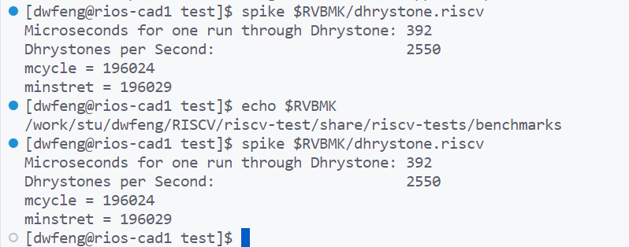
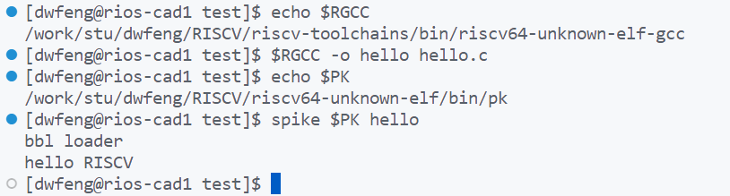

# Modern CPU Design Lab1

<p align=right>2022214053 冯大纬</p>

## 1 Spike model and co-sim

### 1.1 Spike model (with risc-v pk)






### 1.2 GreenRio core RTL

#### makefile

```makefile
RTLPATH = ../rtl/lab_1/src \
	../rtl/lab_1/src/cache \
	../rtl/lab_1/src/cache/cacheblock \
	../rtl/lab_1/src/core_empty \
	../rtl/lab_1/src/core_empty/lsu \
	../rtl/lab_1/src/core_empty/pipeline \
	../rtl/lab_1/src/core_empty/units \
	.

RTLFILE += $(foreach p,$(RTLPATH),$(wildcard $(p)/*.v $(p)/*.sv))

VCSFLAG = -full64 +v2k -kdb -debug_access+all +define+dumpon \
	-sverilog +vcs+lic+wait +vc+list +vpi \
	-timescale=1ns/1ps -v2k_generate +incdir+../rtl/lab_1/src

# VFLAG = +vcs+lic+wait -sverilog -kdb +vc+list +vpi\
# 		+error+20 +lint=TFIPC-L +lint=IIMW-L +lint=GCWM-L +lint=CAWM-L \
# 		+lint=PCWM-L -full64 -timescale=1ns/1ps \
# 		-v2k_generate -debug_access+all +incdir+../rtl/lab_1/src

ELF2HEX = elf2hex.py
ELFPATH = isa/elf
ELFFILE += $(notdir $(foreach p,$(ELFPATH),$(wildcard $(p)/*)))
HEXFILE = $(addsuffix .hex, $(ELFFILE))

#build simv
compile:
	vcs $(VCSFLAG) $(RTLFILE) -top tb_hehe

#build hex file
hex:
	for x in $(ELFFILE); do \
	 python3 $(ELF2HEX) --bit-width 128 --infile isa/elf/$$x --outfile isa/hex/$$x.hex; \
	done

run:
	./simv 2>&1 | tee run.log

all: hex compile run

clean:
	rm -rf $(filter-out $(wildcard *.v *.sv *.py) makefile isa ,$(wildcard *))
	rm -rf isa/hex/*.hex
	rm -rf temp

#test
tt:
	@echo $(RTLPATH)
	@echo $(RTLFILE)
	@echo $(ELFFILE)
	@echo $(HEXFILE)
```

#### run & result

```shell
make hex && make compile && make run
```

```shell
[dwfeng@server1 tb]$ make hex && make compile && make run
for x in add rv64ui-p-add rv64ui-p-addi rv64ui-p-addiw rv64ui-p-addw rv64ui-p-and rv64ui-p-andi rv64ui-p-auipc rv64ui-p-beq rv64ui-p-bge rv64ui-p-bgeu rv64ui-p-blt rv64ui-p-bltu rv64ui-p-bne rv64ui-p-fence_i rv64ui-p-jal rv64ui-p-jalr rv64ui-p-lb rv64ui-p-lbu rv64ui-p-ld rv64ui-p-lh rv64ui-p-lhu rv64ui-p-lui rv64ui-p-lw rv64ui-p-lwu rv64ui-p-ma_data rv64ui-p-or rv64ui-p-ori rv64ui-p-sb rv64ui-p-sd rv64ui-p-sh rv64ui-p-simple rv64ui-p-sll rv64ui-p-slli rv64ui-p-slliw rv64ui-p-sllw rv64ui-p-slt rv64ui-p-slti rv64ui-p-sltiu rv64ui-p-sltu rv64ui-p-sra rv64ui-p-srai rv64ui-p-sraiw rv64ui-p-sraw rv64ui-p-srl rv64ui-p-srli rv64ui-p-srliw rv64ui-p-srlw rv64ui-p-sub rv64ui-p-subw rv64ui-p-sw rv64ui-p-xor rv64ui-p-xori rv64ui-v-add; do \
 python3 elf2hex.py --bit-width 128 --infile isa/elf/$x --outfile isa/hex/$x.hex; \
done
vcs -full64 +v2k -kdb -debug_access+all +define+dumpon -sverilog +vcs+lic+wait +vc+list +vpi -timescale=1ns/1ps -v2k_generate +incdir+../rtl/lab_1/src ../rtl/lab_1/src/bus_arbiter.v ../rtl/lab_1/src/hehe.v ../rtl/lab_1/src/cache/l1dcache.v ../rtl/lab_1/src/cache/l1icache_32.v ../rtl/lab_1/src/cache/cacheblock/sky130_sram_1kbyte_1rw1r_32x256_8.v ../rtl/lab_1/src/cache/cacheblock/sky130_sram_1rw1r_64x256_8.v ../rtl/lab_1/src/cache/cacheblock/std_dffe.v ../rtl/lab_1/src/cache/cacheblock/std_dffr.v ../rtl/lab_1/src/core_empty/core_empty.v ../rtl/lab_1/src/core_empty/lsu/ac.v ../rtl/lab_1/src/core_empty/lsu/agu.v ../rtl/lab_1/src/core_empty/lsu/cu.v ../rtl/lab_1/src/core_empty/lsu/lr.v ../rtl/lab_1/src/core_empty/lsu/lsq.v ../rtl/lab_1/src/core_empty/lsu/nblsu.v ../rtl/lab_1/src/core_empty/pipeline/backend.v ../rtl/lab_1/src/core_empty/pipeline/frontend.v ../rtl/lab_1/src/core_empty/units/btb.v ../rtl/lab_1/src/core_empty/units/counter_rob.v ../rtl/lab_1/src/core_empty/units/counter_tmp.v ../rtl/lab_1/src/core_empty/units/counter.v ../rtl/lab_1/src/core_empty/units/csr.v ../rtl/lab_1/src/core_empty/units/decode.v ../rtl/lab_1/src/core_empty/units/excep_ctrl.v ../rtl/lab_1/src/core_empty/units/fake_icache.v ../rtl/lab_1/src/core_empty/units/fetch.v ../rtl/lab_1/src/core_empty/units/fifo_tmp.v ../rtl/lab_1/src/core_empty/units/fifo.v ../rtl/lab_1/src/core_empty/units/gshare.v ../rtl/lab_1/src/core_empty/units/ins_buffer.v ../rtl/lab_1/src/core_empty/units/new_alu.v ../rtl/lab_1/src/core_empty/units/new_fu.v ../rtl/lab_1/src/core_empty/units/physical_regfile.v ../rtl/lab_1/src/core_empty/units/rcu.v ./tb_hehe.v ./dpram64.sv ./wb_arb.sv ./wb_interconnect.sv -top tb_hehe
                         Chronologic VCS (TM)
       Version Q-2020.03-SP2_Full64 -- Tue Oct 25 11:32:48 2022
               Copyright (c) 1991-2020 by Synopsys Inc.
                         ALL RIGHTS RESERVED

This program is proprietary and confidential information of Synopsys Inc.
and may be used and disclosed only as authorized in a license agreement
controlling such use and disclosure.


Warning-[DEPRECATED_OPTION] Deprecated option used
  The specified option '+vc' is deprecated.
  Please use 'DPI' instead.


Warning-[OBSV2G] Use of the -v2k_generate switch
  This switch will be obsolete in future VCS releases.
  To disable this warning message please add "+warn=noOBSV2G" on command line.

Parsing design file '../rtl/lab_1/src/bus_arbiter.v'
Parsing included file '../rtl/lab_1/src/./params.vh'.
Back to file '../rtl/lab_1/src/bus_arbiter.v'.
Parsing design file '../rtl/lab_1/src/hehe.v'
Parsing included file '../rtl/lab_1/src/params.vh'.
Back to file '../rtl/lab_1/src/hehe.v'.
Parsing design file '../rtl/lab_1/src/cache/l1dcache.v'
Parsing included file '../rtl/lab_1/src/params.vh'.
Back to file '../rtl/lab_1/src/cache/l1dcache.v'.
Parsing design file '../rtl/lab_1/src/cache/l1icache_32.v'
Parsing design file '../rtl/lab_1/src/cache/cacheblock/sky130_sram_1kbyte_1rw1r_32x256_8.v'
Parsing design file '../rtl/lab_1/src/cache/cacheblock/sky130_sram_1rw1r_64x256_8.v'
Parsing design file '../rtl/lab_1/src/cache/cacheblock/std_dffe.v'
Parsing design file '../rtl/lab_1/src/cache/cacheblock/std_dffr.v'
Parsing design file '../rtl/lab_1/src/core_empty/core_empty.v'
Parsing included file '../rtl/lab_1/src/params.vh'.
Back to file '../rtl/lab_1/src/core_empty/core_empty.v'.
Parsing design file '../rtl/lab_1/src/core_empty/lsu/ac.v'
Parsing included file '../rtl/lab_1/src/params.vh'.
Back to file '../rtl/lab_1/src/core_empty/lsu/ac.v'.
Parsing design file '../rtl/lab_1/src/core_empty/lsu/agu.v'
Parsing included file '../rtl/lab_1/src/params.vh'.
Back to file '../rtl/lab_1/src/core_empty/lsu/agu.v'.
Parsing design file '../rtl/lab_1/src/core_empty/lsu/cu.v'
Parsing included file '../rtl/lab_1/src/params.vh'.
Back to file '../rtl/lab_1/src/core_empty/lsu/cu.v'.
Parsing design file '../rtl/lab_1/src/core_empty/lsu/lr.v'
Parsing included file '../rtl/lab_1/src/params.vh'.
Back to file '../rtl/lab_1/src/core_empty/lsu/lr.v'.
Parsing design file '../rtl/lab_1/src/core_empty/lsu/lsq.v'
Parsing included file '../rtl/lab_1/src/params.vh'.
Back to file '../rtl/lab_1/src/core_empty/lsu/lsq.v'.
Parsing design file '../rtl/lab_1/src/core_empty/lsu/nblsu.v'
Parsing included file '../rtl/lab_1/src/params.vh'.
Back to file '../rtl/lab_1/src/core_empty/lsu/nblsu.v'.
Parsing design file '../rtl/lab_1/src/core_empty/pipeline/backend.v'
Parsing included file '../rtl/lab_1/src/params.vh'.
Back to file '../rtl/lab_1/src/core_empty/pipeline/backend.v'.
Parsing design file '../rtl/lab_1/src/core_empty/pipeline/frontend.v'
Parsing included file '../rtl/lab_1/src/params.vh'.
Back to file '../rtl/lab_1/src/core_empty/pipeline/frontend.v'.
Parsing design file '../rtl/lab_1/src/core_empty/units/btb.v'
Parsing design file '../rtl/lab_1/src/core_empty/units/counter_rob.v'
Parsing design file '../rtl/lab_1/src/core_empty/units/counter_tmp.v'
Parsing design file '../rtl/lab_1/src/core_empty/units/counter.v'
Parsing design file '../rtl/lab_1/src/core_empty/units/csr.v'
Parsing included file '../rtl/lab_1/src/params.vh'.
Back to file '../rtl/lab_1/src/core_empty/units/csr.v'.
Parsing design file '../rtl/lab_1/src/core_empty/units/decode.v'
Parsing included file '../rtl/lab_1/src/params.vh'.
Back to file '../rtl/lab_1/src/core_empty/units/decode.v'.
Parsing design file '../rtl/lab_1/src/core_empty/units/excep_ctrl.v'
Parsing included file '../rtl/lab_1/src/params.vh'.
Back to file '../rtl/lab_1/src/core_empty/units/excep_ctrl.v'.
Parsing design file '../rtl/lab_1/src/core_empty/units/fake_icache.v'
Parsing design file '../rtl/lab_1/src/core_empty/units/fetch.v'
Parsing design file '../rtl/lab_1/src/core_empty/units/fifo_tmp.v'
Parsing design file '../rtl/lab_1/src/core_empty/units/fifo.v'
Parsing design file '../rtl/lab_1/src/core_empty/units/gshare.v'
Parsing design file '../rtl/lab_1/src/core_empty/units/ins_buffer.v'
Parsing design file '../rtl/lab_1/src/core_empty/units/new_alu.v'
Parsing design file '../rtl/lab_1/src/core_empty/units/new_fu.v'
Parsing included file '../rtl/lab_1/src/params.vh'.
Back to file '../rtl/lab_1/src/core_empty/units/new_fu.v'.
Parsing design file '../rtl/lab_1/src/core_empty/units/physical_regfile.v'
Parsing design file '../rtl/lab_1/src/core_empty/units/rcu.v'
Parsing included file '../rtl/lab_1/src/params.vh'.
Back to file '../rtl/lab_1/src/core_empty/units/rcu.v'.
Parsing design file './tb_hehe.v'
Parsing design file './dpram64.sv'
Parsing design file './wb_arb.sv'
Parsing design file './wb_interconnect.sv'
Top Level Modules:
       tb_hehe
TimeScale is 1 ns / 1 ps
Starting vcs inline pass...

8 modules and 0 UDP read.
recompiling module l1dcache
recompiling module l1icache_32
recompiling module backend
recompiling module counter_rob
recompiling module csr
recompiling module tb_hehe
recompiling module dpram64
recompiling module wb_interconnect
All of 8 modules done
make[1]: Entering directory '/work/stu/dwfeng/CPULab/CPUDesign/verilog/tb/csrc'
make[1]: Leaving directory '/work/stu/dwfeng/CPULab/CPUDesign/verilog/tb/csrc'
make[1]: Entering directory '/work/stu/dwfeng/CPULab/CPUDesign/verilog/tb/csrc'
rm -f _cuarc*.so _csrc*.so pre_vcsobj_*.so share_vcsobj_*.so
if [ -x ../simv ]; then chmod a-x ../simv; fi
g++  -o ../simv      -rdynamic  -Wl,-rpath='$ORIGIN'/simv.daidir -Wl,-rpath=./simv.daidir -Wl,-rpath=/opt/cad/synopsys/installs/vcs/Q-2020.03-SP2/linux64/lib -L/opt/cad/synopsys/installs/vcs/Q-2020.03-SP2/linux64/lib  -Wl,-rpath-link=./  /usr/lib64/libnuma.so.1   objs/amcQw_d.o  _1361_archive_1.so  SIM_l.o      rmapats_mop.o rmapats.o rmar.o rmar_nd.o  rmar_llvm_0_1.o rmar_llvm_0_0.o          -lvirsim -lerrorinf -lsnpsmalloc -lvfs    -lvcsnew -lsimprofile -luclinative /opt/cad/synopsys/installs/vcs/Q-2020.03-SP2/linux64/lib/vcs_tls.o   -Wl,-whole-archive  -lvcsucli    -Wl,-no-whole-archive       _vcs_pli_stub_.o   /opt/cad/synopsys/installs/vcs/Q-2020.03-SP2/linux64/lib/vcs_save_restore_new.o /opt/cad/synopsys/installs/verdi/Q-2020.03-SP2/share/PLI/VCS/LINUX64/pli.a -ldl  -lc -lm -lpthread -ldl 
../simv up to date
make[1]: Leaving directory '/work/stu/dwfeng/CPULab/CPUDesign/verilog/tb/csrc'
CPU time: 1.382 seconds to compile + .369 seconds to elab + .376 seconds to link
Verdi KDB elaboration done and the database successfully generated: 0 error(s), 0 warning(s)
./simv 2>&1 | tee run.log
Chronologic VCS simulator copyright 1991-2020
Contains Synopsys proprietary information.
Compiler version Q-2020.03-SP2_Full64; Runtime version Q-2020.03-SP2_Full64;  Oct 25 11:32 2022
Preloading tb_hehe.magicmemory from isa/hex/rv64ui-p-add.hex
VCD+ Writer Q-2020.03-SP2_Full64 Copyright (c) 1991-2020 by Synopsys Inc.
*Verdi* Loading libsscore_vcs202003.so
FSDB Dumper for VCS, Release Verdi_Q-2020.03-SP2, Linux x86_64/64bit, 08/31/2020
(C) 1996 - 2020 by Synopsys, Inc.
*Verdi* : Create FSDB file 'novas.fsdb'
*Verdi* : Begin traversing the scopes, layer (0).
*Verdi* : Enable +all dumping.
*Verdi* : End of traversing.
*Verdi* : fsdbDumpon - All FSDB files at 0 ps.
pass test
$finish called from file "./tb_hehe.v", line 119.
$finish at simulation time             28595000
           V C S   S i m u l a t i o n   R e p o r t 
Time: 28595000 ps
CPU Time:      0.520 seconds;       Data structure size:   0.1Mb
Tue Oct 25 11:32:54 2022
[dwfeng@server1 tb]$ 
```

### 1.3 Spike model + GreenRio RTL co-simulation system

#### 1.4 You need to run the elf file on the spike emulator and print the log

```shell
[dwfeng@server1 tb]$ spike -l isa/elf/rv64ui-p-add > log/rv64ui-p-add.log 2>&1
```

Part of the log:

```c++
core   0: 0x0000000000001000 (0x00000297) auipc   t0, 0x0
core   0: 0x0000000000001004 (0x02028593) addi    a1, t0, 32
core   0: 0x0000000000001008 (0xf1402573) csrr    a0, mhartid
core   0: 0x000000000000100c (0x0182b283) ld      t0, 24(t0)
core   0: 0x0000000000001010 (0x00028067) jr      t0
core   0: 0x0000000080000000 (0x0480006f) j       pc + 0x48
core   0: 0x0000000080000048 (0x00000093) li      ra, 0
core   0: 0x000000008000004c (0x00000113) li      sp, 0
core   0: 0x0000000080000050 (0x00000193) li      gp, 0
core   0: 0x0000000080000054 (0x00000213) li      tp, 0
core   0: 0x0000000080000058 (0x00000293) li      t0, 0
core   0: 0x000000008000005c (0x00000313) li      t1, 0
core   0: 0x0000000080000060 (0x00000393) li      t2, 0
core   0: 0x0000000080000064 (0x00000413) li      s0, 0
core   0: 0x0000000080000068 (0x00000493) li      s1, 0
core   0: 0x000000008000006c (0x00000513) li      a0, 0
core   0: 0x0000000080000070 (0x00000593) li      a1, 0
core   0: 0x0000000080000074 (0x00000613) li      a2, 0
core   0: 0x0000000080000078 (0x00000693) li      a3, 0
core   0: 0x000000008000007c (0x00000713) li      a4, 0
....
```

