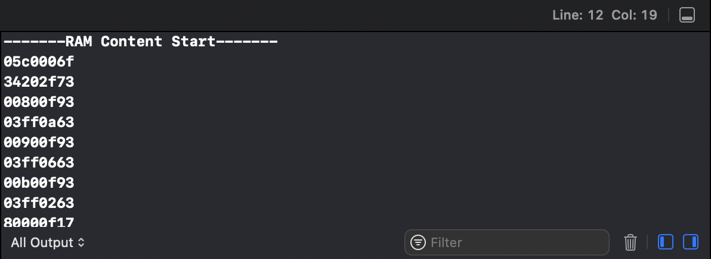

# Modern CPU Design Lab2

<p align=right>2022214053 冯大纬</p>

## CModel

### Control Signals

To connect the frontend, I set three parts of signals:

These signals follows the spec of HeHeCore, which locate at `spec\HeHecore.md`.

PC Generator Signals, connect to PCGen:

```c++
typedef struct {
    bool is_req_pc;
    uint32_t btb_req_pc;
    uint32_t btb_predict_target;
    uint32_t prev_pc;
    bool prev_branch_in;
    bool prev_taken;
    bool rd_en;
    uint32_t pc_out;
    uint32_t next_pc_out;
    uint32_t instruction_out;
    bool valid_real_branch;
    uint32_t real_branch;
} pc_gen_intf_t;
```

Instruction Fetch Signals, connect to FU:

```c++
typedef struct {
    bool valid;
    bool rst;
    uint32_t pc_in;
    uint32_t instruction_out;
    BUS* bus_ctrl;
} if_intf_t;
```

Instruction Decode Signals, connect to Decoder:

```c++
typedef struct {
    bool rstn;
    uint32_t pc_in;
    uint32_t next_pc_in;
    uint32_t instruction_in;
    bool valid_in;
    bool ready_in;
    bool branch_back;
    bool trapped;
    bool wfi_in;
    bool uses_rs1;
    bool uses_rs2;
    bool uses_rd;
    bool uses_csr;
    uint32_t pc_out;
    uint32_t next_pc_out;
    //...
    bool jump_out;
    bool branch_out;
    bool is_alu_out;
    bool load_out;
    bool store_out;
    char load_store_size_out;
    bool load_signed_out;
} id_intf_t;
```

Although I set signals just as the HeHeCore, only part of them are used currently.(Others are used in backend or pipeline design)

### RAM

Test RAM, load the hex file to ram.

Part of the hex file:


Load the hex to RAM:



### PC Generator

Currently only generate the `pc+4`, but signals from BTB or other unit are already connected, will be used later.

```c++
RunCode PCGenarator::update() {
    //this->pc_gen_intf points to the signals connected to PCGenerator.
    this->pc_gen_intf->pc_out=this->pc_gen_intf->prev_pc+4;
    return Success;
}
```

### Fetch Unit

Currently use the `if_intf->valid`signal to check if need to fetch, use the bus to read instruction block from RAM.

```c++
RunCode FU::update() {
    if(if_intf->valid) {
        uint32_t instruction;
        auto pc_=if_intf->pc_in;
        auto bus_=if_intf->bus_ctrl;
        auto code=bus_->readWord(pc_,&instruction);
        if_intf->instruction_out=instruction;
        return code;
    }
    return Success;
}
```

Test Fetch Unit:


Strictly same as the assemble file:


### Decoder

Although quite a lot of signals are connected to decoder, currently only `pc_in, instruction_in`and output signals are used.

```c++
RunCode Decoder::update() {
    StaticInsn instr(id_intf->instruction_in);
    switch (instr.opcode()) {
        case OpcodeLoadFp:
            ...
            break;
            
        default:
            break;
    }
    return Success;
}
```

Test decode result:


Strictly same as the assemble file:


More clearly comparison:


## Openlane


Global routing:

```
[INFO]: Setting signal min routing layer to: met1 and clock min routing layer to met1. 
[INFO]: Setting signal max routing layer to: met4 and clock max routing layer to met4. 
-congestion_iterations 50 -verbose
[INFO GRT-0020] Min routing layer: met1
[INFO GRT-0021] Max routing layer: met4
[INFO GRT-0022] Global adjustment: 30%
[INFO GRT-0023] Grid origin: (0, 0)
[INFO GRT-0043] No OR_DEFAULT vias defined.
[INFO GRT-0088] Layer li1     Track-Pitch = 0.4600  line-2-Via Pitch: 0.3400
[INFO GRT-0088] Layer met1    Track-Pitch = 0.3400  line-2-Via Pitch: 0.3400
[INFO GRT-0088] Layer met2    Track-Pitch = 0.4600  line-2-Via Pitch: 0.3500
[INFO GRT-0088] Layer met3    Track-Pitch = 0.6800  line-2-Via Pitch: 0.6150
[INFO GRT-0088] Layer met4    Track-Pitch = 0.9200  line-2-Via Pitch: 0.6150
[INFO GRT-0019] Found 1 clock nets.
[INFO GRT-0001] Minimum degree: 2
[INFO GRT-0002] Maximum degree: 9149
[INFO GRT-0003] Macros: 0
[INFO GRT-0004] Blockages: 139077

[INFO GRT-0053] Routing resources analysis:
          Routing      Original      Derated      Resource
Layer     Direction    Resources     Resources    Reduction (%)
---------------------------------------------------------------
li1        Vertical            0             0          0.00%
met1       Horizontal    1545680       1026308          33.60%
met2       Vertical      1159260        771999          33.41%
met3       Horizontal     772840        540150          30.11%
met4       Vertical       540988        307484          43.16%
---------------------------------------------------------------

[INFO GRT-0101] Running extra iterations to remove overflow.
[INFO GRT-0197] Via related to pin nodes: 272644
[INFO GRT-0198] Via related Steiner nodes: 11711
[INFO GRT-0199] Via filling finished.
[INFO GRT-0111] Final number of vias: 337621
[INFO GRT-0112] Final usage 3D: 1645053
...
```

Full logs locate at `openlane/lab2`
